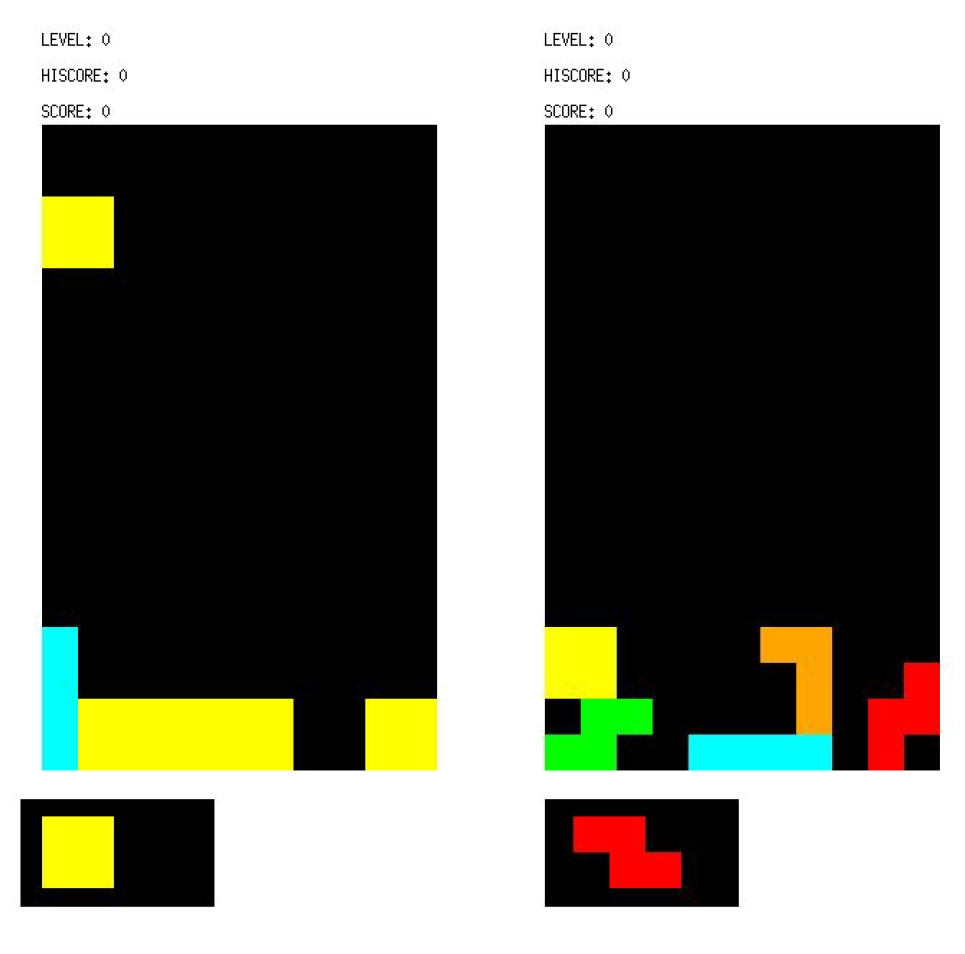

# biquadris
## Overview:

We designed and implemented Biquadris, a Latinization of the game Tetris. In the overview section of this README.md, we will introduce the overall structure of the program. We
will introduce three major sections of the game, as well as their relationships with the minor sections. The program starts running from the main function. The main function is used to read the arguments for most of its parts. Near the end of the main function, it creates a Game object, passes the parameter it reads to the Game object. That being said, the responsibility of the main functions is limited to only read in the parameters. The control flow of the game is handled by the Game object it owns. After the construction of the Game object, it calls the play() method of the Game object.

### Three major Sections

The Game object is the first major section of the program. It is responsible for switching between the two players, and tracks information that is in a higher scope of what
a single board could track, such as the highest score of the two players. It creates and owns two Board objects (one for each player), a GraphicalDisplay object, and a TextDisplay
object. It notifies the two displays to update scores and levels if any change happens. It also passes the GraphicalDisplay object and the TextDisplay object to the two boards it owns, in order for them to notify and update the displays. In the play() method of the Game object, it only controls the turn switching between the two players, and leaves the rest to its boards.

The Board objects are the second major section of the program. Each Board object represents the board of a player. It is the core of the program that processes most of the
functionalities. It also contains a vector<vector<Cell>>. It spawns the block with the corresponding level (details introduced later), takes in commands when it’s the player’s
turn, and moves the block accordingly. When a block is dropped (i.e. end of turn), the Board object will clear the rows and calculate the scores accordingly. Lastly, it will notify the displays to update.

The last major section is the two display classes. They are simply responsible for displaying the changes on and off the boards, such as row clears, score updates, and level changes. They are notified (not as in an observer pattern) by the other major sections of the program all the time. With the display sections, our program achieves the separation of modules for “View” purpose and modules for “Model” and “Control” modules, which ensures that each module only processes one functionality.

### Other Minor Sections
The rest of the program consists of the Block classes, the Level classes, the Cell class, and multiple enumeration classes, information structures, and helper classes. These
are the minor sections that are controlled and used by the three major sections.

## Design

### Observer Pattern
We used two design patterns in our program. The first one is the Observer pattern. The only Subject we have in the program are the Cell objects. These are the individual cells on the board (11x18=198 cells in total). Upon a change, they will notify the three observers in the program: the GraphicalDisplay object, the TextDisplay object, and the Block objects. The reason why the first two are observers of each individual Cell on the board are self-evident - when the state of a cell is changed, the displays should reflect the change. The block is made to be an observer since it needs to track the states of the cells it contains after it drops. When all of the four cells are cleared, the block is considered completed “removed” from the Board, and will get a score incrementation accordingly.

### RAII, unique_ptr, vector and exception safety
In addition to the 4% bonus, we chose to use smart pointers (namely unique_ptr, as we didn’t use any other) and vectors over pointers and arrays to control our memory because
of another reason: it achieves the RAII idiom. By achieving the RAII idiom, we essentially wrapped pointers to heap-allocated objects and heap-allocated objects, and stored them
on the stack. This also ensures a basic guarantee in terms of exception safety levels, since when any exception occurs, the RAII idiom ensures that when the function stacks are
popped, the destructors of these wrapper objects will be called and heap-allocated memories will be properly deleted as if no memory was ever allocated in the heap. This is
also the reason why our program leaks no memory during testing. 

## Resilience to Change

### Factory Method & Dynamic Dispatch / Abstract Class & Inheritance
We implemented the Block generations by using a factory method. Firstly, we implemented the abstract class “Level”, and its concrete subclasses “Level0”, “Level1”, … “Level4”. These Level classes are set in a way that they each spawn blocks differently, according to the rules of Biquadris. For example, a Level3 class will spawn a block with the “heavy” property, while a Level1 class won’t. On the other side, the Level classes also tracks whether the next block is “heavied” by the “heavy” special action. By doing so, the Board class outsourced the generation of blocks to the Level classes, which ensures a high cohesion of the modules. On the other side, the Block classes are implemented in a similar way. We made an abstract Block class, and made eight concrete Block subclasses “IBlock”, “JBlock”, … , “TBlock”, and the special “DotBlock” that only occurs in level 4. By doing so, we can use dynamic dispatch to alleviate the complexity of controlling and tracking the blocks on the board. Now, we only need a unique_ptr<Block> to point to and control the moves of the current Block, and a vector<unique_ptr<Block>> to track the blocks on the boards. These two features are essential to the extent of resilience to change of the program, as if there were more blocks and levels to be added into the program, we can easily achieve so by implementing additional Level classes and Block classes without modifying the rest of the programs.
  
### Command Interpreter & Enumeration classes
We implemented a command interpreter to interpret given commands. The interpreter translates abbreviations into the Command enumerations. Were there any new commands to be added, we simply need to add a few lines of code in the command interpreter class.

### High Cohesion, Low Coupling
Our program achieves a high cohesion and low coupling state, which is suitable for adding new features and modules.
We achieve high cohesion by ensuring that the program maintains the single responsibility principle, that is, each module is only responsible for one task. For example, we clearly separately GraphicalDisplay class and TextDisplay class from the rest of the program, so that the only responsibilities of these classes are to display the board. We used the factory method to ensure that Level class now is in charge of managing and generating new blocks, instead of as another task for the Board class. On the other side, we achieved low coupling as we use the technique of pre-declaring classes in the header files, and placing the include statement in the .cc files as many times as possible. This ensures that there are no dependency loops in our program. In addition, we declared no “Friend” among classes, to ensure the individuality of the classes. Lastly, as you may notice on our UML, the program is structured in a way that there are several major sections as the skeletons of the program, and several minor sections attached to these major sections. Other than the necessary connections among the major sections, the minor sections themselves do not connect to each other, or to other major sections. There is no situation where two major sections share minor sections. This also ensures the low coupling of the program.
